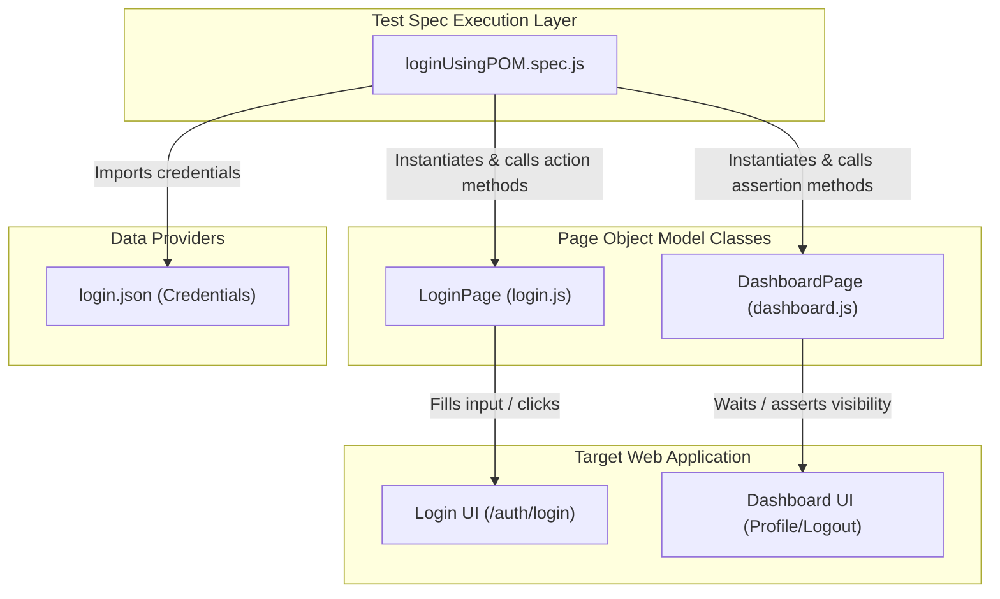

# Learning Playwright E2E Automation

A comprehensive, production-ready multi-project learning workspace designed to master end-to-end (E2E) testing and browser automation using **Playwright**. This repository features two advanced modules: **linkedIn** (focusing on fundamental TypeScript specifications and element locators) and **mukash-youtube** (demonstrating the Page Object Model, data-driven testing, custom dialogs, Allure Reporting, and GitHub Actions CI integrations).

---

## 🛠️ Technology Stack & Testing Stack


---

## 🚀 Core Automation Concepts Practiced

*   **🏛️ Page Object Model (POM)**: Encapsulates page elements and functional actions into custom class objects (`LoginPage.js`, `DashboardPage.js`) ensuring maintainable and DRY test suites.
*   **📊 Data-Driven Testing (DDT)**: Loops test cases dynamically over external datasets (`usersLogin.json`) to automate multi-account test runs in parallel.
*   **🔌 Complete DOM Locators**: Interacts with dropdown lists, handles file uploads, processes complex keyboard inputs, and matches auto-complete search suggestions.
*   **🛡️ Multi-Frame & Tab Handling**: Interacts with inner dynamic `iFrames` and tracks, manages, and switches contexts across browser tabs and popup windows.
*   **🛎️ Dialog Alert Interceptors**: Intercepts native modal windows (`alert`, `confirm`, `prompt`) to programmatically verify modal texts and simulate accept/dismiss actions.
*   **⚙️ Continuous Integration (CI)**: Embeds a full GitHub Actions workflow (`playwright.yml`) to trigger headless browsers, run automated assertions, and upload report artifacts.
*   **📈 Rich Visual Testing Reports**: Integrates Playwright's built-in HTML reporters and advanced Allure reporting matrices.

---

## 📐 Page Object Model (POM) Flow

This diagram outlines how page object classes partition the UI elements from the E2E test execution layer:



---

## 📂 Repository File Directory

```
Learning-Playwright/
├── linkedIn/                      # Fundamental TypeScript Playwright setups
│   ├── .devcontainer/             # Preconfigured Docker container environment
│   ├── tests/
│   │   ├── example.spec.ts        # Basic header element verification specs
│   │   └── login.spec.ts          # Practice Software Testing login script
│   ├── playwright.config.ts       # TypeScript test runner configs
│   ├── RESOURCES.md               # Curated learning resources index
│   └── package.json               # Module manifest and script definitions
└── mukash-youtube/                # Advanced JavaScript Playwright setups
    ├── pages/                     # Page Object Model component wrappers
    │   ├── login.js               # LoginPage locator elements & inputs
    │   └── dashboard.js           # DashboardPage profile & logout elements
    ├── tests/                     # Advanced E2E test scripts
    │   ├── add-delete test...     # Testing additions/removals
    │   ├── dropdown.spec.js       # Selection filters automation
    │   ├── handleAlerts.spec.js   # Intercepting native alert modals
    │   ├── handle-keyboard.js     # Keyboard key combos trigger specs
    │   ├── handle-windows.js      # Multi-tab window switcher specs
    │   ├── uploadfile.spec.js     # Upload file automation cases
    │   ├── loginUsingPOM.spec.js  # Clean POM spec runner
    │   └── loginByMultipleUsers...# Data-driven JSON login loop
    ├── workflows/
    │   └── playwright.yml         # GitHub Actions CI workflow script
    ├── usersLogin.json            # Mock credentials array for DDT
    ├── login.json                 # Mock profile credentials for POM
    ├── playwright.config.js       # JavaScript test runner configs
    └── package.json               # Module dependencies & Allure plugin details
```

---

## 📝 Key Source Code Showcases

### 1. Page Object Class Definition ([login.js](file:///d:/for%20CV/My%20learnings/Learning-Playwright/mukash-youtube/pages/login.js))
Encapsulates selector paths and abstract login routines:
```javascript
import { expect } from "@playwright/test";

class LoginPage {
  constructor(page) {
    this.page = page;
    this.email = "#email";
    this.password = "#password";
    this.loginButton = "//button[@class='btn w-100 btn-primary']";
    this.header = "//h4[normalize-space()='Dashboard Login']";
  }

  async loginToApplication(email, pass) {
    await this.page.fill(this.email, email);
    await this.page.fill(this.password, pass);
    await this.page.click(this.loginButton);
  }

  async verifingToLogout() {
    await expect(this.page.locator(this.header)).toBeVisible();
  }
}

module.exports = LoginPage;
```

### 2. Looping Data-Driven Tests ([loginByMultipleUsersFromJSON.spec.js](file:///d:/for%20CV/My%20learnings/Learning-Playwright/mukash-youtube/tests/loginByMultipleUsersFromJSON.spec.js))
Iterates over multiple users loaded from JSON to automate regression checks dynamically:
```javascript
import { test, expect } from "@playwright/test";
const loginData = JSON.parse(JSON.stringify(require("../usersLogin.json")));

test.describe("Data driven login test", () => {
  for (const data of loginData) {
    test.describe(`Login with user ${data.id}`, () => {
      test("Login test", async ({ page }) => {
        test.setTimeout(60000);
        await page.goto("http://localhost:8000/auth/login");
        await page.getByRole("textbox", { name: "Email address" }).fill(data.email);
        await page.getByRole("textbox", { name: "Password" }).fill(data.password);
        await page.getByRole("button", { name: "Login" }).click();

        await expect(page).toHaveURL("http://localhost:8000/");
        await page.waitForLoadState("networkidle");
      });
    });
  }
});
```

### 3. Native Alert Interceptors ([handleAlerts.spec.js](file:///d:/for%20CV/My%20learnings/Learning-Playwright/mukash-youtube/tests/handleAlerts.spec.js))
Listens for popup triggers and programmatically fires user interactions:
```javascript
test("Handling Javascript Alert Modal", async ({ page }) => {
  await page.goto("https://the-internet.herokuapp.com/javascript_alerts");

  // Hook dialog listener before trigger
  page.on('dialog', async dialog => {
    expect(dialog.message()).toEqual("I am a JS Alert");
    await dialog.accept();
  });

  await page.click("button[onclick='jsAlert()']");
  await expect(page.locator("#result")).toHaveText("You successfully clicked an alert");
});
```

---

## 🚀 Setup & Execution Guide

### Prerequisites
Make sure the following are installed:
*   **Node.js** version 18.0 or higher
*   **npm** (Node package manager)

### Installation & Run Steps
1.  **Clone the Repository**:
    ```bash
    git clone https://github.com/imtiazaly/Learning-Playwright.git
    cd Learning-Playwright
    ```

#### Run Module 1 (linkedIn TypeScript specs)
1.  Navigate and install module dependencies:
    ```bash
    cd linkedIn
    npm install
    ```
2.  Install Playwright browser binaries:
    ```bash
    npx playwright install
    ```
3.  Run tests in headless mode:
    ```bash
    npm test
    ```
4.  Run tests in UI interactive mode:
    ```bash
    npm run test:ui
    ```

#### Run Module 2 (mukash-youtube Advanced JS specs)
1.  Navigate and install module dependencies:
    ```bash
    cd ../mukash-youtube
    npm install
    ```
2.  Run E2E assertions:
    ```bash
    npx playwright test
    ```
3.  Generate & Open Allure Report:
    ```bash
    npx allure generate allure-results --clean
    npx allure open
    ```
